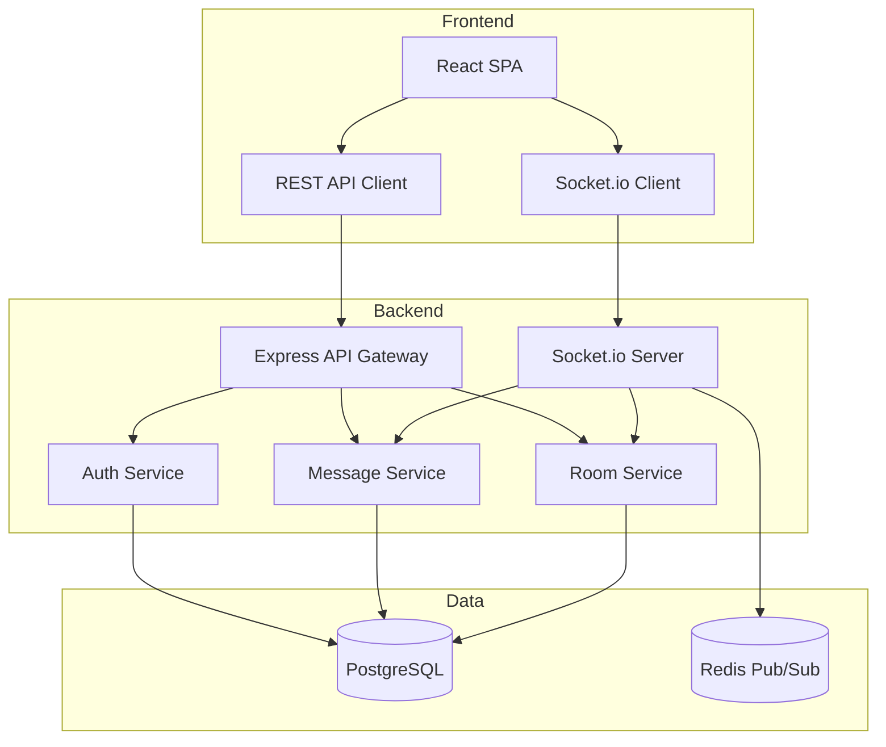
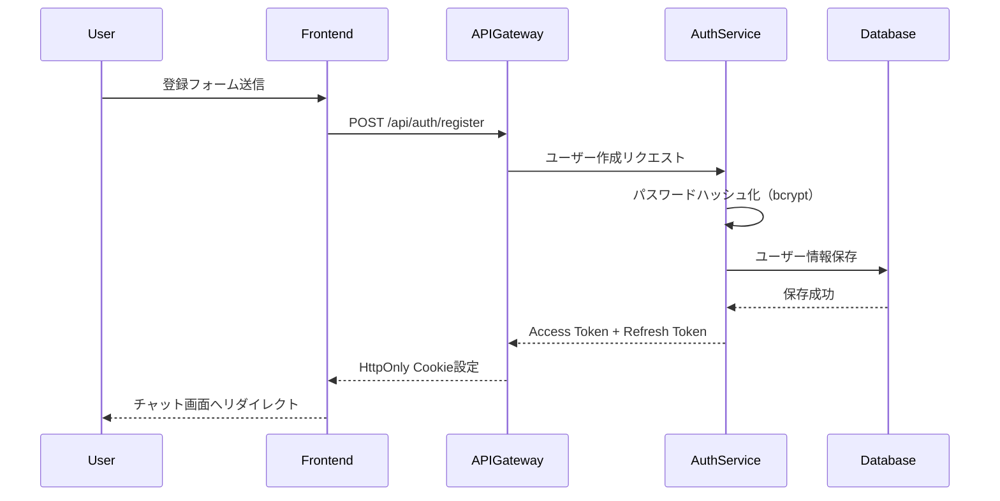
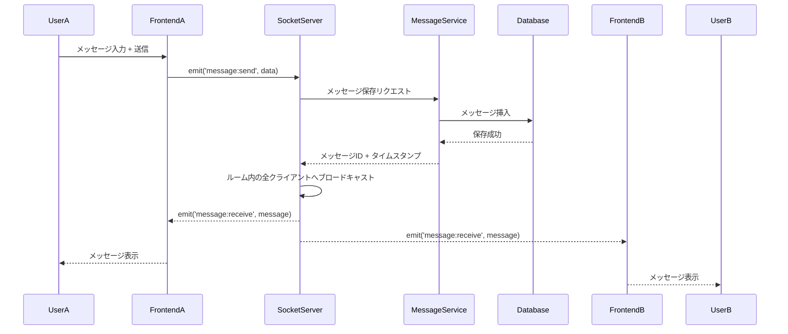
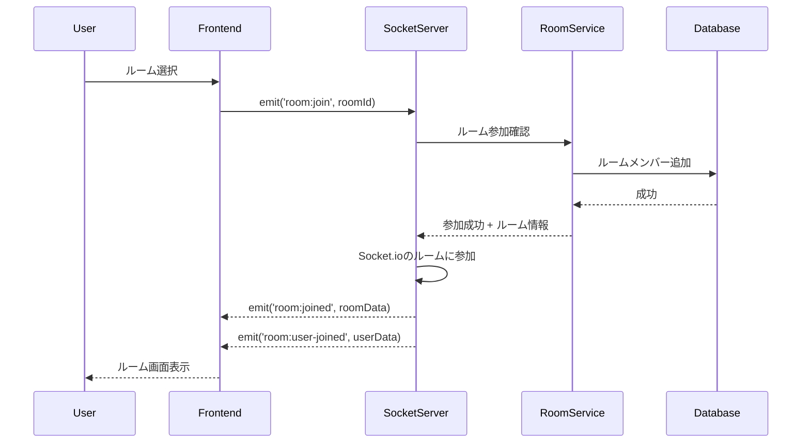
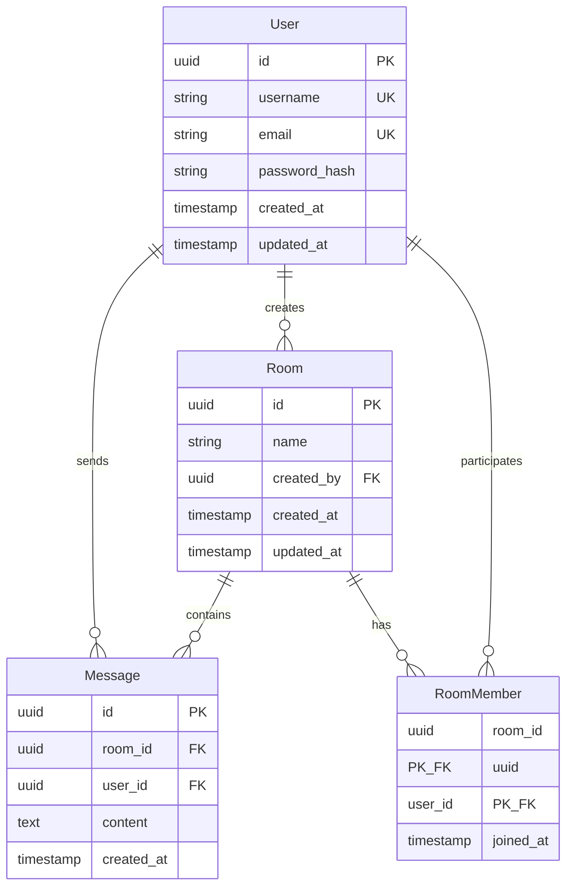

# Technical Design Document

## Overview

**Purpose**: シンプルなチャットアプリケーションは、ユーザーがリアルタイムでメッセージを送受信し、チャットルームを作成・参加できる基本的なチャット機能を提供します。

**Users**: エンドユーザーは、アカウントを作成してログインし、チャットルームに参加してメッセージをやり取りします。

**Impact**: これは新規開発プロジェクトであり、既存システムへの影響はありません。完全に独立したアプリケーションとして構築されます。

### Goals

- リアルタイムメッセージング機能の実装
- セキュアなユーザー認証システムの構築
- チャットルーム作成・管理機能の提供
- レスポンシブなユーザーインターフェースの実現
- スケーラブルなアーキテクチャ設計

### Non-Goals

- ファイル/画像の送信機能（将来の拡張として検討）
- ビデオ/音声通話機能
- エンドツーエンド暗号化（E2EE）
- モバイルネイティブアプリ（初期段階ではWebアプリのみ）
- 外部SNS連携（OAuth 2.0統合）

## Architecture

> 詳細な調査結果は `research.md` を参照。本ドキュメントでは設計決定事項を記載。

### Architecture Pattern & Boundary Map

**選定パターン**: **3層アーキテクチャ（Presentation - Business Logic - Data Access）**

**アーキテクチャ統合**:
- **選定パターン**: 3層アーキテクチャ - フロントエンド（React SPA）、バックエンド（Node.js/Express + Socket.io）、データ層（PostgreSQL）を明確に分離
- **ドメイン境界**:
  - 認証ドメイン（AuthService）: ユーザー登録、ログイン、トークン管理
  - メッセージングドメイン（MessageService）: メッセージ送受信、履歴取得
  - ルーム管理ドメイン（RoomService）: ルーム作成、参加、メンバー管理
- **新規コンポーネントの根拠**:
  - グリーンフィールドプロジェクトのため、すべてのコンポーネントを新規作成
  - 各ドメインは独立したサービスとして実装し、将来のマイクロサービス化に備える
- **ステアリング準拠**: （ステアリングコンテキストが未定義のため、標準的な3層アーキテクチャを採用）



**主要決定事項**:
- フロントエンドとバックエンドを完全に分離し、REST APIとWebSocketで通信
- Socket.ioをリアルタイム通信に使用（自動再接続、ルーム機能）
- Redis Pub/Subは初期実装では不要（単一サーバー構成）、将来の水平スケーリング時にオプションとして追加

### Technology Stack

| Layer | Choice / Version | Role in Feature | Notes |
|-------|------------------|-----------------|-------|
| Frontend | React 18.x + TypeScript 5.x | SPA UI、コンポーネント管理、状態管理 | Viteビルドツール、React Context API/Zustand |
| Frontend Build | Vite 5.x | 高速ビルド、HMR | 開発体験の向上 |
| Frontend State | Zustand 4.x | グローバル状態管理 | 軽量、React Context APIより高性能 |
| Frontend Styling | TailwindCSS 3.x | レスポンシブデザイン | ユーティリティファーストCSS |
| Backend | Node.js 20.x LTS + Express 4.x | REST API、ビジネスロジック | TypeScriptで型安全性を確保 |
| Backend Realtime | Socket.io 4.x | WebSocketベースのリアルタイム通信 | 自動再接続、ルーム管理 |
| Data | PostgreSQL 16.x | ユーザー、ルーム、メッセージの永続化 | ACID保証、リレーショナルデータモデル |
| Data ORM | Prisma 5.x | データベースアクセス層 | 型安全なORM、マイグレーション管理 |
| Messaging | Redis 7.x（オプション） | Pub/Sub（将来の水平スケーリング用） | Socket.io Redis Adapter、初期実装では不要 |
| Infrastructure | Docker + Docker Compose | コンテナ化、開発環境統一 | 本番環境はAWS/GCP等を想定 |

> 技術選定の詳細な根拠とトレードオフは `research.md` を参照。

## System Flows

### フロー1: ユーザー登録とログイン



**主要決定事項**:
- JWTトークンはHttpOnly Cookieで保存（XSS対策）
- Access Token有効期限15分、Refresh Token有効期限7日
- パスワードはbcrypt（コスト12）でハッシュ化

### フロー2: メッセージ送信と配信



**主要決定事項**:
- Socket.ioのルーム機能を使用してメッセージをブロードキャスト
- メッセージは即座にデータベースに保存（永続化）
- クライアントはリアルタイムで`message:receive`イベントを受信
- **責任分離**: MessageServiceはDB永続化のみ担当、SocketServerがWebSocket配信を担当（ベストエフォート）
- **エラーハンドリング**: DB保存失敗時は即座にエラー返却、保存成功後の配信失敗は許容

### フロー3: チャットルーム参加



**主要決定事項**:
- Socket.ioの`socket.join(roomId)`でルームに参加
- 参加通知は同じルーム内の全クライアントにブロードキャスト
- ルームメンバー情報はデータベースに保存

## Requirements Traceability

| Requirement | Summary | Components | Interfaces | Flows |
|-------------|---------|------------|------------|-------|
| 1.1 | ユーザー新規登録 | AuthService, RegisterForm | POST /api/auth/register | ユーザー登録とログイン |
| 1.2 | ユーザーログイン | AuthService, LoginForm | POST /api/auth/login | ユーザー登録とログイン |
| 1.3 | ログイン失敗時のエラー | AuthService, ErrorBanner | POST /api/auth/login (401) | ユーザー登録とログイン |
| 1.4 | ユーザーログアウト | AuthService, LogoutButton | POST /api/auth/logout | ユーザー登録とログイン |
| 1.5 | パスワード暗号化 | AuthService | bcrypt ハッシュ化 | ユーザー登録とログイン |
| 2.1 | メッセージ送信 | MessageService, MessageInput | emit('message:send') | メッセージ送信と配信 |
| 2.2 | 入力フィールドクリア | MessageInput | - | メッセージ送信と配信 |
| 2.3 | 空メッセージの検証 | MessageInput | クライアント側バリデーション | メッセージ送信と配信 |
| 2.4 | タイムスタンプ付与 | MessageService | created_at カラム | メッセージ送信と配信 |
| 2.5 | 送信者識別 | MessageService | user_id 外部キー | メッセージ送信と配信 |
| 3.1 | リアルタイムメッセージ受信 | SocketServer, MessageList | emit('message:receive') | メッセージ送信と配信 |
| 3.2 | 自動スクロール | MessageList | useEffect フック | メッセージ送信と配信 |
| 3.3 | 時系列順表示 | MessageService | ORDER BY created_at | メッセージ送信と配信 |
| 3.4 | 送信者名・タイムスタンプ表示 | MessageItem | UI コンポーネント | メッセージ送信と配信 |
| 4.1 | チャットルーム作成 | RoomService, CreateRoomForm | POST /api/rooms | チャットルーム参加 |
| 4.2 | ルーム選択と履歴表示 | RoomService, MessageList | GET /api/messages?roomId | チャットルーム参加 |
| 4.3 | ルーム参加通知 | SocketServer | emit('room:user-joined') | チャットルーム参加 |
| 4.4 | ルーム一覧表示 | RoomService, RoomList | GET /api/rooms | チャットルーム参加 |
| 4.5 | ルームID・名前付与 | RoomService | rooms テーブル | チャットルーム参加 |
| 5.1 | チャット画面UI | ChatLayout, MessageInput, MessageList | React コンポーネント | - |
| 5.2 | サイドバー表示 | Sidebar, RoomList | React コンポーネント | - |
| 5.3 | ユーザーリスト表示 | UserList | React コンポーネント | - |
| 5.4 | レスポンシブデザイン | TailwindCSS | CSS メディアクエリ | - |
| 5.5 | ローディング状態表示 | LoadingSpinner | React コンポーネント | - |
| 6.1 | 初期履歴読み込み | MessageService | GET /api/messages?roomId&limit=100 | メッセージ送信と配信 |
| 6.2 | 無限スクロール | MessageList | GET /api/messages?roomId&before={timestamp} | メッセージ送信と配信 |
| 6.3 | 時系列順表示 | MessageService | ORDER BY created_at | メッセージ送信と配信 |
| 6.4 | 100件以上保持 | PostgreSQL | messages テーブル | メッセージ送信と配信 |
| 7.1 | 接続エラー処理 | SocketClient, ErrorBanner | Socket.io 再接続 | メッセージ送信と配信 |
| 7.2 | 送信失敗処理 | MessageInput, ToastNotification | エラーハンドリング | メッセージ送信と配信 |
| 7.3 | サーバーエラー処理 | APIClient, ErrorBanner | HTTP エラーコード処理 | 全フロー |
| 7.4 | 自動再接続 | SocketClient | Socket.io reconnection | メッセージ送信と配信 |
| 7.5 | エラーログ記録 | Logger Service | Winston/Pino | 全フロー |

## Components and Interfaces

### コンポーネント概要

| Component | Domain/Layer | Intent | Req Coverage | Key Dependencies (P0/P1) | Contracts |
|-----------|--------------|--------|--------------|--------------------------|-----------|
| AuthService | Backend/Business Logic | ユーザー認証とトークン管理 | 1.1-1.5 | Prisma (P0), bcrypt (P0), jsonwebtoken (P0) | Service, API |
| MessageService | Backend/Business Logic | メッセージ送受信と履歴管理 | 2.1-2.5, 3.1-3.4, 6.1-6.4 | Prisma (P0), SocketServer (P0) | Service, API, Event |
| RoomService | Backend/Business Logic | チャットルーム管理 | 4.1-4.5 | Prisma (P0), SocketServer (P0) | Service, API, Event |
| SocketServer | Backend/Infrastructure | リアルタイム通信管理 | 2.1, 3.1, 4.3, 7.1, 7.4 | Socket.io (P0), Redis (P1) | Event |
| ChatLayout | Frontend/UI | チャット画面レイアウト | 5.1, 5.4 | MessageList (P0), Sidebar (P0) | State |
| MessageList | Frontend/UI | メッセージ一覧表示 | 3.1-3.4, 6.1-6.3 | MessageService API (P0) | State |
| MessageInput | Frontend/UI | メッセージ入力と送信 | 2.1-2.3, 7.2 | SocketClient (P0) | Event |
| RoomList | Frontend/UI | チャットルーム一覧 | 4.4, 5.2 | RoomService API (P0) | State |
| LoginForm | Frontend/UI | ログインフォーム | 1.2, 1.3 | AuthService API (P0) | State |
| RegisterForm | Frontend/UI | 新規登録フォーム | 1.1 | AuthService API (P0) | State |

---

### Backend / Business Logic

#### AuthService

| Field | Detail |
|-------|--------|
| Intent | ユーザー認証、トークン生成、パスワード管理を担当 |
| Requirements | 1.1, 1.2, 1.3, 1.4, 1.5 |

**Responsibilities & Constraints**
- ユーザー登録時のパスワードハッシュ化（bcrypt、コスト12）
- JWT トークン生成（Access Token 15分、Refresh Token 7日）
- トークン検証とリフレッシュ
- データベーストランザクション境界: ユーザー作成時

**Dependencies**
- Inbound: APIGateway - HTTP リクエスト処理 (P0)
- Outbound: PostgreSQL - ユーザー情報の永続化 (P0)
- External: bcrypt - パスワードハッシュ化 (P0)
- External: jsonwebtoken - JWT 生成・検証 (P0)

**Contracts**: Service [x] / API [x] / Event [ ] / Batch [ ] / State [ ]

##### Service Interface

```typescript
interface AuthService {
  register(input: RegisterInput): Promise<Result<AuthTokens, AuthError>>;
  login(input: LoginInput): Promise<Result<AuthTokens, AuthError>>;
  logout(userId: string): Promise<Result<void, AuthError>>;
  refreshToken(refreshToken: string): Promise<Result<AuthTokens, AuthError>>;
  verifyAccessToken(token: string): Promise<Result<UserPayload, AuthError>>;
}

interface RegisterInput {
  username: string;  // 3-20文字、英数字とアンダースコア
  email: string;     // RFC 5322準拠
  password: string;  // 8-128文字、1つ以上の数字と大文字を含む
}

interface LoginInput {
  email: string;
  password: string;
}

interface AuthTokens {
  accessToken: string;
  refreshToken: string;
  expiresIn: number;  // 秒単位
}

interface UserPayload {
  userId: string;
  username: string;
  email: string;
}

type AuthError =
  | { type: 'INVALID_CREDENTIALS'; message: string }
  | { type: 'USER_ALREADY_EXISTS'; message: string }
  | { type: 'TOKEN_EXPIRED'; message: string }
  | { type: 'TOKEN_INVALID'; message: string }
  | { type: 'INTERNAL_ERROR'; message: string };
```

- **Preconditions**:
  - `register`: username, email, passwordが有効な形式
  - `login`: email, passwordが提供されている
  - `verifyAccessToken`: トークンが提供されている
- **Postconditions**:
  - `register`: 新しいユーザーがデータベースに作成され、トークンが返される
  - `login`: 認証成功時にトークンが返される
- **Invariants**: パスワードは常にハッシュ化された状態で保存される

##### API Contract

| Method | Endpoint | Request | Response | Errors |
|--------|----------|---------|----------|--------|
| POST | /api/auth/register | RegisterInput | AuthTokens（HttpOnly Cookie） | 400, 409, 500 |
| POST | /api/auth/login | LoginInput | AuthTokens（HttpOnly Cookie） | 400, 401, 500 |
| POST | /api/auth/logout | - | { success: true } | 401, 500 |
| POST | /api/auth/refresh | - | AuthTokens（HttpOnly Cookie） | 401, 500 |

**Implementation Notes**
- **Integration**: Express.jsのミドルウェアとして実装、`express-validator`で入力検証
- **Validation**: クライアント側とサーバー側の両方で検証
- **Risks**: トークンの盗難リスク - HttpOnly Cookie + HTTPS + SameSite属性で緩和

---

#### MessageService

| Field | Detail |
|-------|--------|
| Intent | メッセージの送受信、履歴管理、永続化を担当 |
| Requirements | 2.1, 2.2, 2.3, 2.4, 2.5, 3.1, 3.2, 3.3, 3.4, 6.1, 6.2, 6.3, 6.4 |

**Responsibilities & Constraints**
- メッセージの永続化（PostgreSQL）
- メッセージ履歴のページネーション
- リアルタイム配信のトリガー（Socket.io経由）
- データベーストランザクション境界: メッセージ挿入時

**Dependencies**
- Inbound: APIGateway - HTTP リクエスト処理 (P0)
- Inbound: SocketServer - WebSocket イベント処理 (P0)
- Outbound: PostgreSQL - メッセージの永続化 (P0)
- Note: MessageServiceはSocket.ioに直接依存せず、データベース永続化のみを担当。WebSocketブロードキャストはSocketServerが実施

**Contracts**: Service [x] / API [x] / Event [x] / Batch [ ] / State [ ]

##### Service Interface

```typescript
interface MessageService {
  sendMessage(input: SendMessageInput): Promise<Result<Message, MessageError>>;
  getMessages(input: GetMessagesInput): Promise<Result<Message[], MessageError>>;
  getMessageById(messageId: string): Promise<Result<Message, MessageError>>;
}

interface SendMessageInput {
  roomId: string;
  userId: string;
  content: string;  // 1-10000文字
}

interface GetMessagesInput {
  roomId: string;
  limit?: number;    // デフォルト100、最大200
  before?: Date;     // カーソルベースページネーション
}

interface Message {
  id: string;
  roomId: string;
  userId: string;
  username: string;
  content: string;
  createdAt: Date;
}

type MessageError =
  | { type: 'EMPTY_CONTENT'; message: string }
  | { type: 'ROOM_NOT_FOUND'; message: string }
  | { type: 'UNAUTHORIZED'; message: string }
  | { type: 'INTERNAL_ERROR'; message: string };
```

- **Preconditions**:
  - `sendMessage`: ユーザーは認証済みで、ルームに参加している
  - `getMessages`: ルームIDが有効
- **Postconditions**:
  - `sendMessage`: メッセージがデータベースに保存され、Socket.io経由でブロードキャストされる
- **Invariants**: メッセージ内容は常に1-10000文字の範囲

##### API Contract

| Method | Endpoint | Request | Response | Errors |
|--------|----------|---------|----------|--------|
| GET | /api/messages | { roomId, limit?, before? } | Message[] | 400, 404, 500 |
| GET | /api/messages/:id | - | Message | 404, 500 |

##### Event Contract

- **Published events**: なし（MessageServiceはSocket.ioに直接イベントを発行しない）
- **Subscribed events**: なし（SocketServerから同期的にサービスメソッドを呼び出される）
- **Ordering / delivery guarantees**: N/A（WebSocket配信はSocketServerが担当）

**Implementation Notes**
- **Integration**: REST APIとサービスメソッド（SocketServerから呼び出し）を提供
- **Validation**: contentの長さ検証、XSS対策（HTMLエスケープ）
- **責任分離**: MessageServiceはデータベース永続化のみを担当。WebSocketブロードキャストはSocketServerが実施（ベストエフォート配信）
- **エラーハンドリング**: DB保存失敗時はエラーを返却し、SocketServerがクライアントにエラー通知。保存成功後の配信失敗は許容（ベストエフォート）
- **Risks**: メッセージ履歴が膨大になるとクエリが遅延 - インデックス最適化で緩和

---

#### RoomService

| Field | Detail |
|-------|--------|
| Intent | チャットルームの作成、参加、管理を担当 |
| Requirements | 4.1, 4.2, 4.3, 4.4, 4.5 |

**Responsibilities & Constraints**
- ルームの作成と削除
- ルームメンバーの管理
- ルーム一覧の取得
- データベーストランザクション境界: ルーム作成・参加時

**Dependencies**
- Inbound: APIGateway - HTTP リクエスト処理 (P0)
- Inbound: SocketServer - WebSocket イベント処理 (P0)
- Outbound: PostgreSQL - ルーム情報の永続化 (P0)

**Contracts**: Service [x] / API [x] / Event [x] / Batch [ ] / State [ ]

##### Service Interface

```typescript
interface RoomService {
  createRoom(input: CreateRoomInput): Promise<Result<Room, RoomError>>;
  getRooms(userId: string): Promise<Result<Room[], RoomError>>;
  getRoomById(roomId: string): Promise<Result<Room, RoomError>>;
  joinRoom(userId: string, roomId: string): Promise<Result<RoomMember, RoomError>>;
  leaveRoom(userId: string, roomId: string): Promise<Result<void, RoomError>>;
  getRoomMembers(roomId: string): Promise<Result<RoomMember[], RoomError>>;
}

interface CreateRoomInput {
  name: string;       // 1-100文字
  createdBy: string;  // ユーザーID
}

interface Room {
  id: string;
  name: string;
  createdBy: string;
  createdAt: Date;
}

interface RoomMember {
  roomId: string;
  userId: string;
  username: string;
  joinedAt: Date;
}

type RoomError =
  | { type: 'ROOM_NOT_FOUND'; message: string }
  | { type: 'ALREADY_MEMBER'; message: string }
  | { type: 'NOT_MEMBER'; message: string }
  | { type: 'UNAUTHORIZED'; message: string }
  | { type: 'INTERNAL_ERROR'; message: string };
```

- **Preconditions**:
  - `createRoom`: ユーザーは認証済み
  - `joinRoom`: ルームが存在し、ユーザーが認証済み
- **Postconditions**:
  - `createRoom`: 新しいルームが作成され、作成者が自動的にメンバーになる
  - `joinRoom`: ユーザーがルームメンバーに追加される
- **Invariants**: ルーム名は常に1-100文字の範囲

##### API Contract

| Method | Endpoint | Request | Response | Errors |
|--------|----------|---------|----------|--------|
| POST | /api/rooms | CreateRoomInput | Room | 400, 401, 500 |
| GET | /api/rooms | - | Room[] | 401, 500 |
| GET | /api/rooms/:id | - | Room | 404, 500 |
| POST | /api/rooms/:id/join | - | RoomMember | 404, 409, 500 |
| POST | /api/rooms/:id/leave | - | { success: true } | 404, 500 |
| GET | /api/rooms/:id/members | - | RoomMember[] | 404, 500 |

##### Event Contract

- **Published events**:
  - `room:user-joined`: ユーザーがルームに参加したときにブロードキャスト
  - Payload: `{ roomId, userId, username, joinedAt }`
  - `room:user-left`: ユーザーがルームを退出したときにブロードキャスト
  - Payload: `{ roomId, userId }`
- **Subscribed events**:
  - `room:join`: クライアントからルーム参加リクエストを受信
  - Payload: `{ roomId }`
  - `room:leave`: クライアントからルーム退出リクエストを受信
  - Payload: `{ roomId }`
- **Ordering / delivery guarantees**: Socket.ioのイベント順序保証に依存

**Implementation Notes**
- **Integration**: REST APIとWebSocketの両方を提供
- **Validation**: ルーム名の長さ検証、重複チェック
- **Risks**: ルームメンバー数が増えるとクエリが遅延 - インデックス最適化で緩和

---

### Backend / Infrastructure

#### SocketServer

| Field | Detail |
|-------|--------|
| Intent | Socket.ioを使用したリアルタイム双方向通信の管理 |
| Requirements | 2.1, 3.1, 4.3, 7.1, 7.4 |

**Responsibilities & Constraints**
- WebSocket接続の確立と管理
- クライアント認証（JWT検証）
- ルームへの参加/退出管理
- イベントのブロードキャスト
- 自動再接続の処理

**Dependencies**
- Inbound: Frontend SocketClient - WebSocket接続 (P0)
- Outbound: MessageService - メッセージ処理 (P0)
- Outbound: RoomService - ルーム管理 (P0)
- External: Socket.io - WebSocketライブラリ (P0)
- External: Redis - Pub/Sub（水平スケーリング用） (P1)

**Contracts**: Service [ ] / API [ ] / Event [x] / Batch [ ] / State [ ]

##### Event Contract

- **Published events**:
  - `message:receive`: メッセージ受信イベント
  - `room:user-joined`: ユーザー参加イベント
  - `room:user-left`: ユーザー退出イベント
  - `error`: エラーイベント
- **Subscribed events**:
  - `connection`: クライアント接続
  - `disconnect`: クライアント切断
  - `message:send`: メッセージ送信リクエスト
  - `room:join`: ルーム参加リクエスト
  - `room:leave`: ルーム退出リクエスト
- **Ordering / delivery guarantees**: TCP順序保証、Socket.ioのACK機能を使用

**Implementation Notes**
- **Integration**: Express.jsサーバーと統合、HTTPサーバーを共有
- **Authentication**:
  - WebSocket接続時、ブラウザはHTTPSハンドシェイクで自動的にHttpOnly Cookieを送信
  - Socket.ioのミドルウェア（`io.use()`）でHandshakeリクエストからCookieを抽出してJWTトークンを検証
  - 検証成功時に`socket.data.user`にユーザー情報を保存、失敗時は接続を拒否
  - セキュリティ: クエリパラメータでのトークン送信は禁止（ログ漏洩リスク）
- **Reconnection**: 指数バックオフ戦略（初回1秒、最大30秒）
- **Redis Adapter**:
  - 初期実装では不要（単一サーバー構成）
  - 水平スケーリング時にRedis Pub/Subアダプターを追加（設定ファイルで有効化）
  - Socket.ioコンストラクタで環境変数`REDIS_ENABLED`をチェックし、条件分岐
- **Risks**: 接続数が増えるとメモリ使用量が増加 - 将来的にRedis Adapterで水平スケーリング

---

### Frontend / UI

#### ChatLayout

| Field | Detail |
|-------|--------|
| Intent | チャット画面全体のレイアウトとコンポーネント配置を管理 |
| Requirements | 5.1, 5.4 |

**Responsibilities & Constraints**
- サイドバー、メインコンテンツエリア、ヘッダーの配置
- レスポンシブデザインの実装（モバイル・タブレット・デスクトップ）
- グローバル状態（現在のルーム、ユーザー情報）の提供

**Dependencies**
- Outbound: Sidebar - ルーム一覧とユーザーリスト (P0)
- Outbound: MessageList - メッセージ表示エリア (P0)
- Outbound: MessageInput - メッセージ入力エリア (P0)

**Contracts**: Service [ ] / API [ ] / Event [ ] / Batch [ ] / State [x]

##### State Management

```typescript
interface ChatLayoutProps {
  currentUser: User;
  currentRoom: Room | null;
}

interface User {
  id: string;
  username: string;
  email: string;
}

interface Room {
  id: string;
  name: string;
  createdBy: string;
  createdAt: Date;
}
```

- **State model**: Zustandストアで管理（currentUser、currentRoom、rooms、messages）
- **Persistence & consistency**: LocalStorageにユーザー情報をキャッシュ
- **Concurrency strategy**: React 18のConcurrent Featuresを使用

**Implementation Notes**
- **Integration**: TailwindCSSでレスポンシブデザイン、Flexbox/Gridレイアウト
- **Validation**: なし（レイアウトコンポーネント）
- **Risks**: なし

---

#### MessageList

| Field | Detail |
|-------|--------|
| Intent | メッセージ履歴を時系列順に表示し、無限スクロールを実装 |
| Requirements | 3.1, 3.2, 3.3, 3.4, 6.1, 6.2, 6.3 |

**Responsibilities & Constraints**
- メッセージ一覧の表示（時系列順）
- 無限スクロール（上にスクロールで過去メッセージ取得）
- 自動スクロール（新着メッセージ受信時）
- ローディング状態の表示

**Dependencies**
- Inbound: MessageService API - メッセージ履歴取得 (P0)
- Inbound: SocketClient - 新着メッセージ受信 (P0)
- Outbound: MessageItem - 個別メッセージ表示 (P0)

**Contracts**: Service [ ] / API [ ] / Event [ ] / Batch [ ] / State [x]

##### State Management

```typescript
interface MessageListState {
  messages: Message[];
  loading: boolean;
  hasMore: boolean;
  error: string | null;
}

interface Message {
  id: string;
  roomId: string;
  userId: string;
  username: string;
  content: string;
  createdAt: Date;
}
```

- **State model**: Zustandストアで管理、`messages`配列を時系列順にソート
- **Persistence & consistency**: メモリ内のみ（再読み込み時はAPIから再取得）
- **Concurrency strategy**: useTransitionフックで非同期データ取得

**Implementation Notes**
- **Integration**: `react-virtualized`または`react-window`で仮想化リスト実装（パフォーマンス最適化）
- **Infinite Scroll**: Intersection Observer APIで上端検知
- **Auto Scroll**: `useEffect`で新着メッセージ検知時に`scrollIntoView`
- **Risks**: メッセージ数が多い場合のレンダリングパフォーマンス - 仮想化で緩和

---

#### MessageInput

| Field | Detail |
|-------|--------|
| Intent | メッセージ入力フィールドと送信ボタンを提供 |
| Requirements | 2.1, 2.2, 2.3, 7.2 |

**Responsibilities & Constraints**
- メッセージ入力フィールドの表示
- 送信ボタンのクリック処理
- 空メッセージのクライアント側検証
- 送信失敗時のエラー表示

**Dependencies**
- Outbound: SocketClient - メッセージ送信イベント (P0)
- Outbound: ToastNotification - エラー通知 (P1)

**Contracts**: Service [ ] / API [ ] / Event [x] / Batch [ ] / State [x]

##### State Management

```typescript
interface MessageInputState {
  content: string;
  sending: boolean;
  error: string | null;
}
```

- **State model**: ローカルステート（`useState`）で管理
- **Persistence & consistency**: なし（送信失敗時は再入力）
- **Concurrency strategy**: 送信中は送信ボタンを無効化

**Implementation Notes**
- **Integration**: Socket.ioの`emit('message:send', { roomId, content })`
- **Validation**:
  - 空文字チェック（送信前）
  - 10000文字制限（クライアント側）
  - HTMLエスケープ（XSS対策）
- **Risks**: ネットワーク遅延時の送信失敗 - 再送信ボタンで緩和

---

#### RoomList

| Field | Detail |
|-------|--------|
| Intent | ユーザーが参加しているチャットルーム一覧を表示 |
| Requirements | 4.4, 5.2 |

**Responsibilities & Constraints**
- ルーム一覧の取得と表示
- ルーム選択時の画面遷移
- 新規ルーム作成ボタンの表示

**Dependencies**
- Inbound: RoomService API - ルーム一覧取得 (P0)
- Outbound: RoomItem - 個別ルーム表示 (P0)
- Outbound: CreateRoomForm - ルーム作成モーダル (P1)

**Contracts**: Service [ ] / API [ ] / Event [ ] / Batch [ ] / State [x]

##### State Management

```typescript
interface RoomListState {
  rooms: Room[];
  loading: boolean;
  error: string | null;
}
```

- **State model**: Zustandストアで管理
- **Persistence & consistency**: 初回ロード時にAPIから取得、以降はキャッシュ
- **Concurrency strategy**: useTransitionフックで非同期データ取得

**Implementation Notes**
- **Integration**: `GET /api/rooms`でルーム一覧取得
- **Validation**: なし（表示のみ）
- **Risks**: ルーム数が多い場合のレンダリングパフォーマンス - ページネーションまたは検索機能で緩和

---

#### LoginForm / RegisterForm

| Field | Detail |
|-------|--------|
| Intent | ユーザーログイン・新規登録フォームの表示と処理 |
| Requirements | 1.1, 1.2, 1.3 |

**Responsibilities & Constraints**
- フォーム入力フィールドの表示（email、password、username）
- クライアント側バリデーション
- 送信ボタンの処理
- エラーメッセージの表示

**Dependencies**
- Outbound: AuthService API - 認証リクエスト (P0)
- Outbound: ErrorBanner - エラー表示 (P1)

**Contracts**: Service [ ] / API [ ] / Event [ ] / Batch [ ] / State [x]

##### State Management

```typescript
interface LoginFormState {
  email: string;
  password: string;
  loading: boolean;
  error: string | null;
}

interface RegisterFormState extends LoginFormState {
  username: string;
  confirmPassword: string;
}
```

- **State model**: ローカルステート（`useState`）で管理
- **Persistence & consistency**: なし（送信失敗時は再入力）
- **Concurrency strategy**: 送信中は送信ボタンを無効化

**Implementation Notes**
- **Integration**: `POST /api/auth/login` または `POST /api/auth/register`
- **Validation**:
  - Emailフォーマット検証
  - パスワード強度チェック（8文字以上、数字・大文字を含む）
  - confirmPasswordの一致確認
- **Risks**: なし

---

## Data Models

### Domain Model

**主要エンティティ**:

1. **User（ユーザー）**
   - 属性: id, username, email, password_hash, created_at, updated_at
   - 役割: システムのアクター、メッセージの送信者
   - ビジネスルール: usernameとemailは一意、パスワードはハッシュ化されて保存

2. **Room（チャットルーム）**
   - 属性: id, name, created_by (外部キー), created_at, updated_at
   - 役割: メッセージをグループ化する境界
   - ビジネスルール: 作成者は自動的にメンバーになる

3. **Message（メッセージ）**
   - 属性: id, room_id (外部キー), user_id (外部キー), content, created_at
   - 役割: ユーザー間のコミュニケーション単位
   - ビジネスルール: メッセージは必ずルームとユーザーに紐づく

4. **RoomMember（ルームメンバー）**
   - 属性: room_id (外部キー), user_id (外部キー), joined_at
   - 役割: ユーザーとルームの多対多関係
   - ビジネスルール: 同じユーザーは同じルームに1度だけ参加可能

**集約ルート**:
- **User**: 認証とプロフィール管理の集約ルート
- **Room**: ルームとそのメンバーの集約ルート
- **Message**: メッセージは独立したエンティティ（Roomに従属）

**ドメインイベント**:
- `UserRegistered`: ユーザー登録時
- `MessageSent`: メッセージ送信時
- `RoomCreated`: ルーム作成時
- `UserJoinedRoom`: ユーザーがルームに参加時



### Logical Data Model

**エンティティ関係**:
- User (1) - (N) Message: 1人のユーザーが複数のメッセージを送信
- User (N) - (M) Room: 多対多関係（RoomMemberテーブルで解決）
- Room (1) - (N) Message: 1つのルームに複数のメッセージが含まれる

**整合性制約**:
- `messages.user_id` → `users.id`: ON DELETE CASCADE（ユーザー削除時にメッセージも削除）
- `messages.room_id` → `rooms.id`: ON DELETE CASCADE（ルーム削除時にメッセージも削除）
- `room_members.user_id` → `users.id`: ON DELETE CASCADE
- `room_members.room_id` → `rooms.id`: ON DELETE CASCADE

**トランザクション境界**:
- ユーザー登録: `users`テーブルへのINSERT
- メッセージ送信: `messages`テーブルへのINSERT
- ルーム作成: `rooms`テーブルへのINSERT + `room_members`テーブルへのINSERT（トランザクション）

### Physical Data Model

**PostgreSQL スキーマ定義**:

```sql
-- Users テーブル
CREATE TABLE users (
    id UUID PRIMARY KEY DEFAULT gen_random_uuid(),
    username VARCHAR(20) NOT NULL UNIQUE,
    email VARCHAR(255) NOT NULL UNIQUE,
    password_hash VARCHAR(255) NOT NULL,
    created_at TIMESTAMP NOT NULL DEFAULT NOW(),
    updated_at TIMESTAMP NOT NULL DEFAULT NOW()
);

CREATE INDEX idx_users_email ON users(email);
CREATE INDEX idx_users_username ON users(username);

-- Rooms テーブル
CREATE TABLE rooms (
    id UUID PRIMARY KEY DEFAULT gen_random_uuid(),
    name VARCHAR(100) NOT NULL,
    created_by UUID NOT NULL REFERENCES users(id) ON DELETE CASCADE,
    created_at TIMESTAMP NOT NULL DEFAULT NOW(),
    updated_at TIMESTAMP NOT NULL DEFAULT NOW()
);

CREATE INDEX idx_rooms_created_by ON rooms(created_by);

-- Messages テーブル
CREATE TABLE messages (
    id UUID PRIMARY KEY DEFAULT gen_random_uuid(),
    room_id UUID NOT NULL REFERENCES rooms(id) ON DELETE CASCADE,
    user_id UUID NOT NULL REFERENCES users(id) ON DELETE CASCADE,
    content TEXT NOT NULL CHECK (char_length(content) <= 10000),
    created_at TIMESTAMP NOT NULL DEFAULT NOW()
);

CREATE INDEX idx_messages_room_id ON messages(room_id);
CREATE INDEX idx_messages_room_id_created_at ON messages(room_id, created_at DESC);
CREATE INDEX idx_messages_user_id ON messages(user_id);

-- RoomMembers テーブル
CREATE TABLE room_members (
    room_id UUID NOT NULL REFERENCES rooms(id) ON DELETE CASCADE,
    user_id UUID NOT NULL REFERENCES users(id) ON DELETE CASCADE,
    joined_at TIMESTAMP NOT NULL DEFAULT NOW(),
    PRIMARY KEY (room_id, user_id)
);

CREATE INDEX idx_room_members_user_id ON room_members(user_id);
CREATE INDEX idx_room_members_room_id ON room_members(room_id);
```

**インデックス戦略**:
- `idx_messages_room_id_created_at`: メッセージ履歴取得クエリの最適化（ルームIDと作成日時の複合インデックス）
- `idx_users_email`: ログイン時のメールアドレス検索の高速化
- `idx_room_members_user_id`: ユーザーが参加しているルーム一覧の高速取得

**パーティショニング戦略**:
- 初期段階では不要
- メッセージ数が数百万件を超えた場合、`messages`テーブルを`created_at`で月次パーティション

### Data Contracts & Integration

**API Data Transfer (JSON)**:

```typescript
// POST /api/auth/register リクエスト
interface RegisterRequest {
  username: string;
  email: string;
  password: string;
}

// POST /api/auth/register レスポンス
interface RegisterResponse {
  success: boolean;
  user: {
    id: string;
    username: string;
    email: string;
  };
}

// GET /api/messages レスポンス
interface GetMessagesResponse {
  messages: Array<{
    id: string;
    roomId: string;
    userId: string;
    username: string;
    content: string;
    createdAt: string;  // ISO 8601フォーマット
  }>;
  hasMore: boolean;
}
```

**Event Schemas (WebSocket)**:

```typescript
// message:send イベント（クライアント → サーバー）
interface MessageSendEvent {
  roomId: string;
  content: string;
}

// message:receive イベント（サーバー → クライアント）
interface MessageReceiveEvent {
  id: string;
  roomId: string;
  userId: string;
  username: string;
  content: string;
  createdAt: string;  // ISO 8601フォーマット
}

// room:user-joined イベント（サーバー → クライアント）
interface RoomUserJoinedEvent {
  roomId: string;
  userId: string;
  username: string;
  joinedAt: string;  // ISO 8601フォーマット
}
```

**Schema Versioning**:
- API: URLバージョニング（`/api/v1/`）
- WebSocket: イベント名にバージョン接尾辞（`message:send:v1`）- 初期段階では不要

**Backward Compatibility**:
- データベーススキーマ変更時は、非破壊的マイグレーション（新カラム追加、旧カラム非推奨）
- API変更時は、旧バージョンを6ヶ月間サポート

## Error Handling

### Error Strategy

各エラータイプに対して具体的な処理パターンを定義し、ユーザーに明確なフィードバックを提供します。

### Error Categories and Responses

#### User Errors (4xx)

| Error Type | HTTP Code | Description | Response |
|------------|-----------|-------------|----------|
| Invalid Input | 400 | フォーム入力が無効 | フィールドレベルのエラーメッセージを表示 |
| Unauthorized | 401 | 認証トークンが無効または期限切れ | ログイン画面にリダイレクト |
| Forbidden | 403 | 権限不足 | アクセス拒否メッセージを表示 |
| Not Found | 404 | リソースが存在しない | ナビゲーションガイダンスを表示 |
| Conflict | 409 | リソース重複（例: ユーザー名・メール重複） | 代替案を提案 |

**処理方法**:
- フロントエンド: フォームフィールド下にエラーメッセージを表示
- バックエンド: 構造化されたエラーレスポンス（`{ error: { type, message, field? } }`）

#### System Errors (5xx)

| Error Type | HTTP Code | Description | Response |
|------------|-----------|-------------|----------|
| Internal Server Error | 500 | サーバー内部エラー | ユーザーフレンドリーなエラーメッセージを表示、エラーIDをログ記録 |
| Service Unavailable | 503 | データベース接続失敗、外部サービス障害 | リトライボタンを提供、Circuit Breakerで自動フォールバック |
| Gateway Timeout | 504 | タイムアウト | 再試行またはキャンセルオプションを提供 |

**処理方法**:
- フロントエンド: トースト通知またはエラーバナーで表示
- バックエンド: エラーログにスタックトレースと関連情報を記録

#### Business Logic Errors (422)

| Error Type | Description | Response |
|------------|-------------|----------|
| Empty Message | メッセージ内容が空 | "メッセージを入力してください" と表示 |
| Room Not Found | ルームが存在しない | "このルームは削除されました" と通知、ルーム一覧に戻る |
| Already Member | 既にルームメンバー | "既にこのルームに参加しています" と通知 |

**処理方法**:
- ビジネスルール違反を明確に説明し、次のアクションを提案

### Network Errors

| Error Type | Description | Response |
|------------|-------------|----------|
| Connection Lost | WebSocket接続切断 | "接続が切断されました。再接続中..." と表示、自動再接続 |
| Timeout | リクエストタイムアウト | "タイムアウトしました。もう一度お試しください" と表示 |
| CORS Error | クロスオリジンエラー | 開発環境のみ表示、本番環境では発生しない |

**処理方法**:
- Socket.ioの自動再接続機能を活用（指数バックオフ: 1秒、2秒、4秒、...、最大30秒）
- 接続状態をUIに表示（接続中、接続済み、切断中）

### Monitoring

**エラートラッキング**:
- **Sentry** または **LogRocket** を使用してフロントエンドエラーを追跡
- バックエンドエラーは **Winston** または **Pino** でログ記録

**ログレベル**:
- `ERROR`: システムエラー、予期しない例外
- `WARN`: ビジネスロジックエラー、リトライ可能なエラー
- `INFO`: 通常のリクエスト、イベント
- `DEBUG`: 開発環境のみ

**ヘルスチェック**:
- `GET /api/health`: データベース接続、Redis接続、サーバー状態を返す
- `GET /api/health/ready`: サービスが準備完了かどうかを返す（Kubernetes Readiness Probe）

## Testing Strategy

### Unit Tests

**対象コンポーネント**:
1. **AuthService.register**: パスワードハッシュ化、ユーザー重複チェック
2. **AuthService.verifyAccessToken**: トークン検証、有効期限チェック
3. **MessageService.sendMessage**: メッセージバリデーション、データベース挿入
4. **RoomService.createRoom**: ルーム作成、メンバー自動追加
5. **Validation Utilities**: メール検証、パスワード強度チェック

**テストフレームワーク**: Jest + ts-jest

**カバレッジ目標**: 80%以上（ビジネスロジック層）

### Integration Tests

**対象フロー**:
1. **ユーザー登録 → ログイン → トークン取得**: REST APIエンドポイントの統合テスト
2. **メッセージ送信 → WebSocket配信 → データベース保存**: Socket.ioとMessageServiceの統合
3. **ルーム作成 → 参加 → メンバー通知**: RoomServiceとSocket.ioの統合
4. **トークンリフレッシュ**: Access Token期限切れ時のRefresh Token使用
5. **エラーハンドリング**: 無効な入力、認証失敗、ネットワークエラー

**テストフレームワーク**: Supertest（REST API）+ Socket.io Client（WebSocket）

**テストデータベース**: Docker Composeで独立したPostgreSQLコンテナを使用

### E2E Tests

**対象ユーザーパス**:
1. **新規ユーザー登録 → ルーム作成 → メッセージ送信**
2. **既存ユーザーログイン → ルーム参加 → メッセージ受信**
3. **複数ユーザー間のリアルタイムメッセージング**
4. **ネットワーク切断 → 自動再接続 → メッセージ同期**
5. **レスポンシブデザイン**: モバイル、タブレット、デスクトップの表示確認

**テストフレームワーク**: Playwright または Cypress

**テスト環境**: Docker Composeでフルスタック環境を構築

### Performance Tests

**対象シナリオ**:
1. **同時接続数**: 1000ユーザーの同時WebSocket接続
2. **メッセージ送信レート**: 100メッセージ/秒の送信負荷
3. **データベースクエリ**: 10万件のメッセージ履歴取得のレスポンスタイム
4. **メモリ使用量**: 長時間接続時のメモリリーク検証

**テストツール**: Artillery または k6

**パフォーマンス目標**:
- メッセージ送信レイテンシ: 平均100ms以下
- メッセージ履歴取得: 平均200ms以下
- WebSocket接続確立: 平均500ms以下

## Security Considerations

### 認証とアクセス制御

- **JWT認証**: Access Token（15分）+ Refresh Token（7日）
- **トークン保存**: HttpOnly Cookie（Secure、SameSite=Strict属性）
- **パスワードハッシュ化**: bcrypt（コスト12）
- **トークンローテーション**: Refresh Token使用時に新しいRefresh Tokenを発行

### データ保護

- **HTTPS強制**: すべての通信をHTTPS経由で実施
- **Content Security Policy (CSP)**: XSS攻撃を防ぐためのCSPヘッダー設定
- **CORS設定**: 許可されたオリジンのみアクセス可能
- **Rate Limiting**: APIエンドポイントにレート制限を適用（例: 100リクエスト/分）

### 入力検証

- **クライアント側検証**: React Hook Formでフォーム入力を検証
- **サーバー側検証**: express-validatorで全入力を再検証
- **XSS対策**: HTMLエスケープ（DOMPurifyまたはXSS-clean）
- **SQLインジェクション対策**: Prisma ORMのパラメータ化クエリ

### セキュリティヘッダー

```typescript
// Helmet.jsを使用したセキュリティヘッダー設定
app.use(helmet({
  contentSecurityPolicy: {
    directives: {
      defaultSrc: ["'self'"],
      scriptSrc: ["'self'"],
      styleSrc: ["'self'", "'unsafe-inline'"],
      imgSrc: ["'self'", "data:", "https:"],
      connectSrc: ["'self'", "wss://"],
    },
  },
  hsts: {
    maxAge: 31536000,
    includeSubDomains: true,
    preload: true,
  },
}));
```

### 脆弱性対策

- **Dependency Scanning**: npm audit / Snyk でパッケージの脆弱性をスキャン
- **Secret Management**: 環境変数でシークレットを管理（.envファイルはGit除外）
- **Logging**: パスワードやトークンはログに記録しない

## Performance & Scalability

### パフォーマンス目標

| メトリック | 目標値 | 測定方法 |
|-----------|--------|---------|
| メッセージ送信レイテンシ | < 100ms (P95) | WebSocket RTT測定 |
| メッセージ履歴取得 | < 200ms (P95) | APIレスポンスタイム |
| WebSocket接続確立 | < 500ms (P95) | 接続時間測定 |
| 同時接続ユーザー数 | 1000+ | 負荷テスト |

### スケーリング戦略

**垂直スケーリング（初期段階）**:
- CPUとメモリを増強（例: 2vCPU → 4vCPU）
- PostgreSQLのconnection poolを最適化（pgBouncerまたはPrismaのconnection limit）

**水平スケーリング（将来）**:
- **Socket.ioサーバー**: Redis Pub/Subアダプターを使用して複数インスタンスに分散
- **APIサーバー**: ロードバランサー（Nginx/ALB）で複数インスタンスに分散
- **データベース**: Read Replica（読み取り専用レプリカ）でクエリを分散

### キャッシング戦略

- **ルーム一覧**: Redisに5分間キャッシュ（頻繁に変更されないため）
- **ユーザー情報**: Redisに15分間キャッシュ（Access Tokenの有効期限と一致）
- **メッセージ履歴**: キャッシュしない（リアルタイム性を優先）

### 最適化技術

- **フロントエンド**:
  - React.memoとuseMemoでレンダリング最適化
  - react-windowで仮想化リスト実装（メッセージ一覧）
  - Code Splittingでバンドルサイズを削減
- **バックエンド**:
  - データベースインデックス最適化
  - N+1クエリ問題の解消（Prismaのincludeで一括取得）
  - WebSocketのメッセージ圧縮（permessage-deflate）

---

## 設計完了

本設計ドキュメントは、シンプルなチャットアプリケーションの技術設計を包括的に定義しています。次のステップとして、タスク生成フェーズに進み、実装タスクを作成してください。
